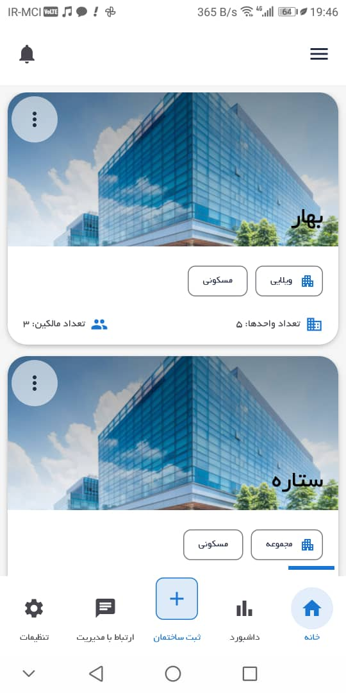
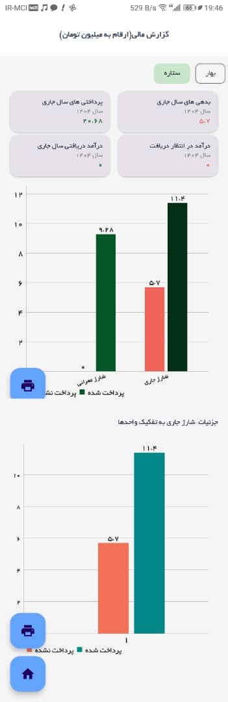
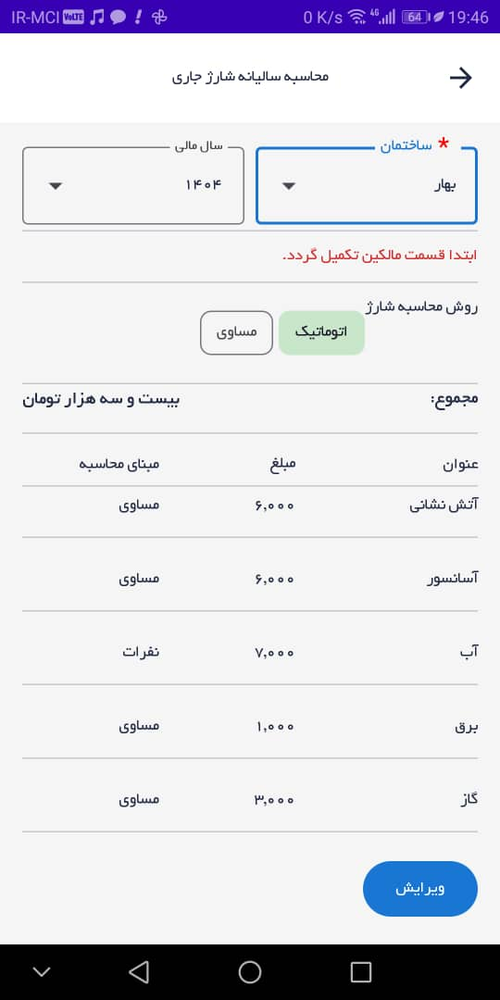
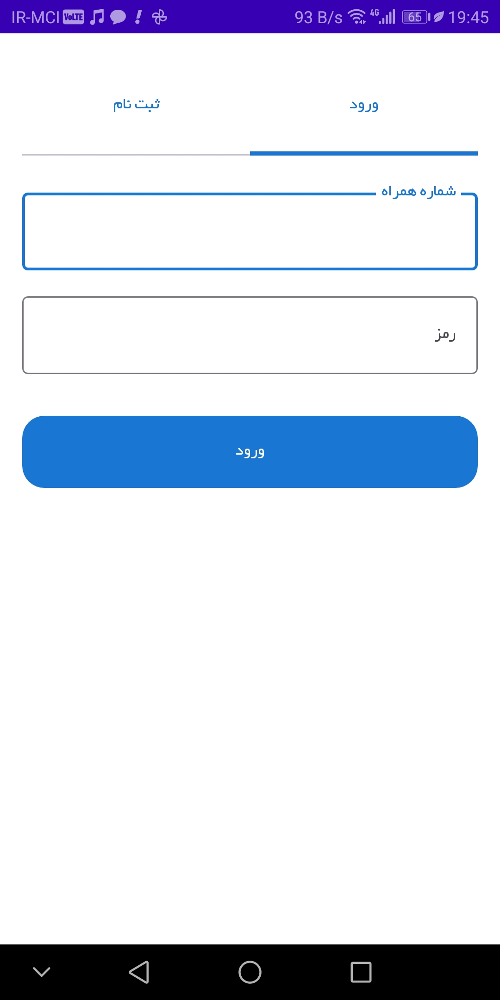
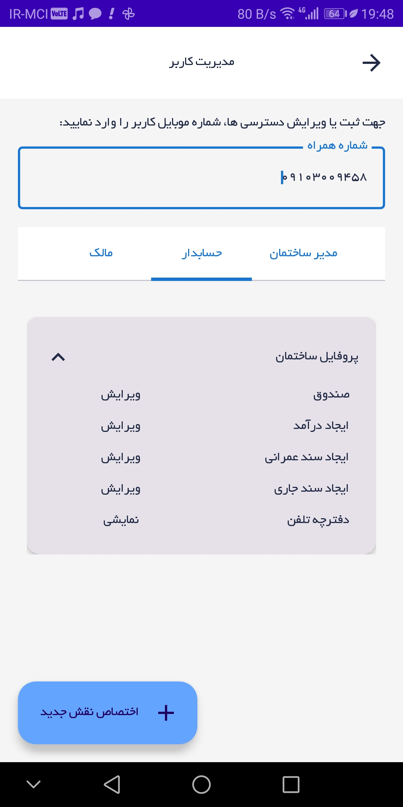
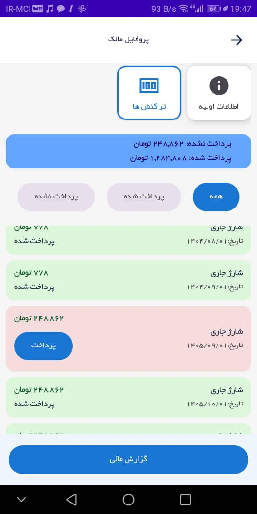

Delta is an Android application designed for building and property management.
It helps residents and building managers handle daily operations such as announcements, payments, and shared facilities in a simple and structured way.

## Features
- User authentication with role-based access (resident / manager)
- Building announcements and notifications
- Unit and resident management
- Expense and payment tracking
- Firebase-based backend integration
- Modern UI built with Jetpack Compose
- Offline-friendly data handling

## Tech Stack
- Kotlin
- Jetpack Compose
- MVVM Architecture
- Firebase Authentication
- Coroutines & Flow
- Material Design 3

## Architecture
The project follows MVVM architecture:

- UI layer (Jetpack Compose screens)
- ViewModel layer (state and business logic)
- Repository layer (data sources)
- Firebase as backend service

## Project Status
This project is based on a real-world building management use case and is under active development.

## Screenshots

| Home | Cost_Income_Dashboard | Operational_Charge |
|---|---|---|
|  |  |  |

| Login_registration | User_Management | Resident_Profile_payment |
|---|---|---|
|  |  |  |

